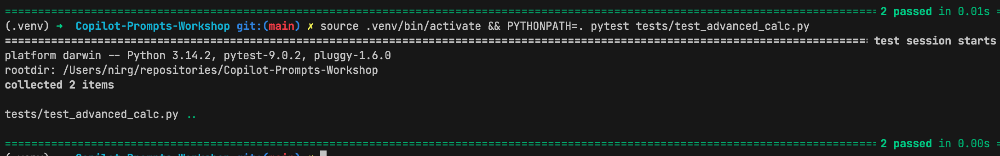

# Lab 07 - Agent Mode (Part 01)

- In this lab, we will explore **Agent Mode**.
- `Agent Mode` can **run terminal commands**, **create and edit files**, and **iterate** on (user and automate) requests until the task is complete.
- `Agent Mode` is ideal for tasks like "fix all linting errors", "implement this feature and add tests", or "refactor this module".

## Overview

- **Agent Mode** enables Copilot to:
  - Execute terminal commands (run tests, list files, etc.).
  - Create, read, and edit multiple files.
  - Analyze error output and self-correct.
  - Handle multi-step instructions without constant user intervention.
  - Iterate until the task is complete.
  - work and update multiple files in a single session.

---

## Exercises

### 1. TDD with Agent

- We will use `Agent Mode` to implement new features in our `Calculator` class using a Test-Driven Development (TDD) approach.

  - **Create New Tests**:

    - Create a new file named `tests/test_advanced_calc.py`.
    - Add the following code to define tests for `power` (exponentiation) and `modulus` (remainder) operations, **which don't exist yet**.

      ```python
      import pytest
      from calculator.calculator import Calculator

      def test_power():
          calc = Calculator()
          assert calc.power(2, 3) == 8
          assert calc.power(5, 0) == 1
          assert calc.power(2, -1) == 0.5

      def test_modulus():
          calc = Calculator()
          assert calc.modulus(10, 3) == 1
          assert calc.modulus(10, 5) == 0
      ```

---

### 2. Using Agent Mode:

- Open **Copilot Chat**
- Open New Chat
- Switch to **Agent Mode** 
- Ensure the working directory is set to the root of the `Copilot-Prompts-Workshop` project
- Make sure you already have `pytest` installed in your environment.
- Type the following prompt:
  ```text
  I have created a new test file `tests/test_advanced_calc.py` with new tests.
  Please run these tests to confirm they fail, then implement the missing
  methods in `calculator/calculator.py` to make all tests pass.
  ```
-  **Observe the Agent**:
      

      - The Agent will likely:
        - Run `pytest tests/test_advanced_calc.py` and see the failures (AttributeError).
        - Read `calculator/calculator.py`.
        - Edit `calculator/calculator.py` to add `power` and `modulus` methods.
        - Re-run the tests to verify they pass.

      

---

### 3. Handling Edge Cases and Iteration

- Now let's ask the Agent to handle a more complex scenario involving error handling.

  1.  **Update Requirements**:

      - We want to ensure `modulus` raises a `ValueError` when dividing by zero.

  2.  **Prompt**:

      ```text
      Update the calculator with `modulus` method to raise a ValueError if the second argument is 0.
      Also, add a test case to `tests/test_advanced_calc.py` that verifies this exception is raised.
      ```
      <details>
      <summary>Example Test Case for Exception</summary>
      ```python
      import pytest
      from calculator.calculator import Calculator

      def test_power():
          calc = Calculator()
          assert calc.power(2, 3) == 8
          assert calc.power(5, 0) == 1
          assert calc.power(2, -1) == 0.5

      def test_modulus():
          calc = Calculator()
          assert calc.modulus(10, 3) == 1
          assert calc.modulus(10, 5) == 0

      def test_modulus_by_zero():
          calc = Calculator()
          with pytest.raises(ValueError, match="Cannot calculate modulus with zero divisor."):
              calc.modulus(10, 0)
      ```
      </details>

  3.  **Review Changes**:
      - The Agent should:
        - Modify `calculator/calculator.py` to add the check.
        - Modify `tests/test_advanced_calc.py` to add the exception test.
        - Run the tests to confirm everything is green.

---

## Summary

- You have successfully used **Agent Mode** to:
  - Detect failing tests.
  - Implement code to satisfy requirements.
  - Iterate on code to add error handling and additional test coverage.
  - Verify the solution by running tests **automatically**.
